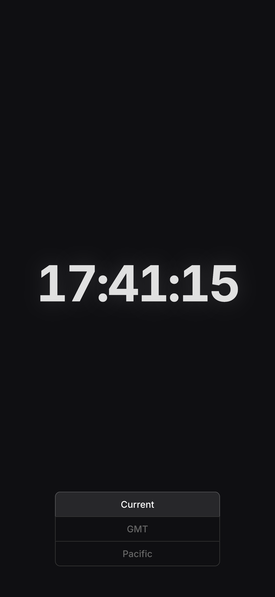

# clock

A simple clock that shows the current time down to the second.

The iOS clock app doesn't show seconds and most of the clock apps on the app store are either paid or have ads. I wanted a simple clock that I could use on my phone and didn't want to pay for it.

Created with [vite-pwa](https://github.com/vite-pwa/vite-plugin-pwa) using the `vanilla-ts` template.
